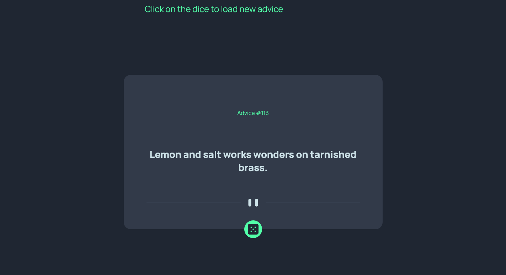
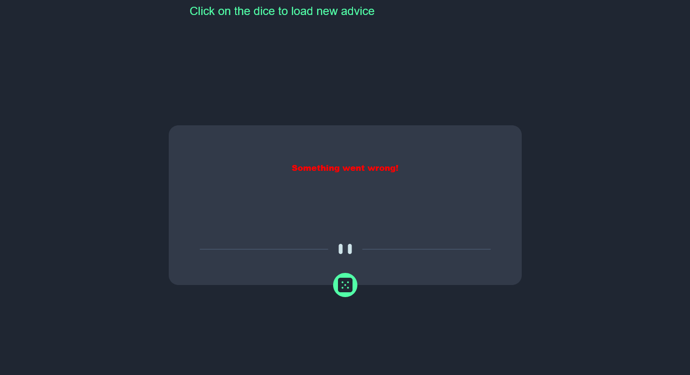

# Frontend Mentor - Advice generator app solution

This is a solution to the [Advice generator app challenge on Frontend Mentor](https://www.frontendmentor.io/challenges/advice-generator-app-QdUG-13db).

## Table of contents

- [Overview](#overview)
  - [The challenge](#the-challenge)
  - [Screenshot](#screenshot)
  - [Links](#links)
- [My process](#my-process)
  - [Built with](#built-with)
  - [What I learned](#what-i-learned)
  - [Continued development](#continued-development)
- [Author](#author)
- [Acknowledgments](#acknowledgments)

**Note: Delete this note and update the table of contents based on what sections you keep.**

## Overview

### The challenge

Users should be able to:

- View the optimal layout for the app depending on their device's screen size
- See hover states for all interactive elements on the page
- Generate a new piece of advice by clicking the dice icon

### Screenshot

#### When Code Works


#### When there is an error, e.g Internet Connection.


### Links

- Live Site URL: [https://promtech-advice-generator.netlify.app/](https://promtech-advice-generator.netlify.app/)

## My process

### Built with

- Semantic HTML5 markup
- CSS custom properties
- Flexbox
- Mobile-first workflow
- Javascript
- API Integration
- Async/Await


### What I learned

I really learnt alot in this project. I learnt how to use the fetch API to fetch data from an API. I also improved in my css styling and learnt new ways to structure my code better. I also learnt how to handle errors using the try/catch syntax that async/await provides. I also learnt how to handle events better in Javascript. I also learnt how to use Dom manipulation to dynamically update the content of the webpage.

To see how you can add code snippets, see below:

```html
<marquee direction="ltr" scrollamount="8">Click on the dice to load new advice</marquee>
```
```css
.dice{
    position: absolute;
    bottom: -25px;
    background-color: hsl(150, 100%, 66%);
    left: 50%;
    transform: translate(-50%, 0);
    width: 50px;
    height: 50px;
    display: flex;
    justify-content: center;
    align-items: center;
    border-radius: 50%;
    cursor: pointer;
}
```
```js
let timestamp = Date.now(); // Get current timestamp
let url = `https://api.adviceslip.com/advice?timestamp=${timestamp}`; // Append timestamp as a query parameter
let response = await fetch(url);
let data = await response.json();
```

### Continued development

- Async/Await.
- Timestamps.
- Caching with API integration.


## Author
- Website - [Jonathan-Uwagboe Promise](https://github.com/Promtech1)


## Acknowledgments

I give great thanks to my Lord and Saviour Jesus Christ for making me see this project through. He really lead me through the internet to see I came out with something great
